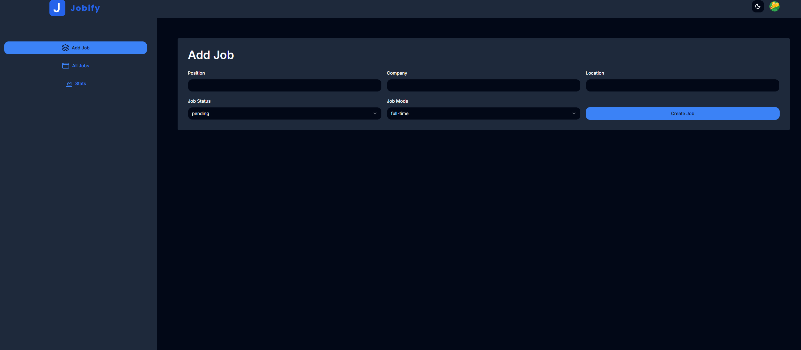
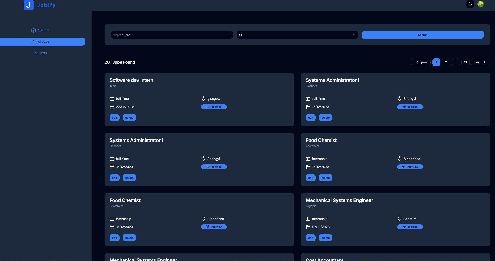
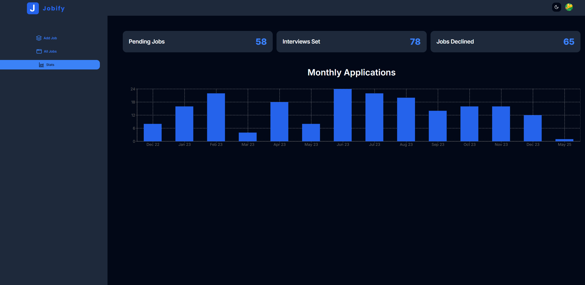

# Jobify

## Table of Contents

* [About The Project](#about-the-project)
    * [Key Features](#key-features)
* [Built With](#built-with)
* [What I Learned](#what-i-learned)
* [Challenges Faced](#challenges-faced)
* [Screenshots & Demo](#screenshots--demo)
* [Future Enhancements](#future-enhancements)
* [Contact](#contact)
* [License](#license)
* [Acknowledgements](#acknowledgements)

---

## About The Project

Jobify is a personal job application tracking dashboard designed to help users effectively manage their job search journey. From initial application to interview stages, Jobify provides a centralized platform to record, update, and visualize the status of each application. With intuitive tracking and insightful statistics, Jobify streamlines the job hunt, keeping users organized and informed.

This project showcases robust full-stack development skills, focusing on secure user authentication, dynamic data management, and data visualization.

### Key Features

* **Secure User Authentication:** Users must first log in using **Clerk/nextjs** to access their personalized job tracking dashboard, ensuring data privacy.
* **Job Creation & Tracking:**
    * Easily add new job applications by entering details such as job title, company, location, and key statuses.
    * **Job Status:** Track the progress of applications with predefined statuses: `Pending`, `Interview Scheduled`, `Declined`.
    * **Job Mode:** Categorize jobs by employment type: `Full-time`, `Part-time`, `Internship`.
* **Job Management:** View all submitted job applications in a clean, organized list, with options to `Edit` or `Delete` entries as needed.
* **Dynamic Stats Dashboard:** A dedicated "Stats" page provides valuable insights into the job search:
    * **Application Trend Graph:** A visual graph illustrating the number of jobs applied for each month over time, helping users identify patterns.
    * **Status Overview:** Quick statistical breakdown at the top, showing the total count of jobs categorized as `Declined`, `Pending`, and `Interview Scheduled`.

---

## Built With

This project is built with a modern and efficient technology stack, ensuring a responsive, scalable, and type-safe application.

* **Frontend Framework:** [Next.js](https://nextjs.org/)
* **Language:** [TypeScript](https://www.typescriptlang.org/)
* **Styling:** [Tailwind CSS](https://tailwindcss.com/)
* **UI Components:** [Shadcn/UI](https://ui.shadcn.com/)
* **Database:** [Render](https://render.com/) (used for database hosting, typically PostgreSQL)
* **Authentication:** [Clerk.dev](https://clerk.com/) (`@clerk/nextjs`)
* **API Client:** [Axios](https://axios-http.com/)
* **Schema Validation:** [Zod](https://zod.dev/)
* **Charting Library:** (Potentially add a placeholder here if you used one, e.g., Recharts, Chart.js)

---

## What I Learned

Building Jobify was an enriching experience that significantly expanded my capabilities in developing robust and user-centric web applications. Key insights and skills gained include:

* **Data Modeling for User-Specific Content:** Designed and implemented a database schema on **Render (PostgreSQL)** that efficiently stores and retrieves job application data, ensuring each user's data is isolated and secure. This involved understanding relationships and indexing for optimal performance.
* **Server-Side Logic with Next.js API Routes:** Gained proficiency in building backend API routes within Next.js, handling CRUD operations for job applications and serving aggregated data for the statistics dashboard. This reinforced my understanding of API design and data handling.
* **Advanced Authentication & Authorization:** Deeper dive into **Clerk.dev** for managing complex authentication states, protecting routes, and associating user IDs with their respective job data, ensuring only authenticated users can access and modify their records.
* **Dynamic UI with Reactive Data:** Implemented real-time or near real-time updates to the UI using **Next.js's data fetching mechanisms** and **React's state management**, ensuring that adding, editing, or deleting jobs instantly reflects on the "All Jobs" and "Stats" pages.
* **Data Aggregation and Visualization:** Learned to perform complex database queries (or backend logic) to aggregate job data by status and month, and then present this information clearly using a charting library (e.g., how to format data for charts and interpret trends).
* **Robust Form Handling and Validation:** Utilized **Zod** for comprehensive schema validation on both client and server sides, ensuring data integrity for job application forms and preventing invalid entries.
* **Component Reusability with Shadcn/UI:** Effectively leveraged **Shadcn/UI** components, customizing them with **Tailwind CSS** to build a consistent, accessible, and aesthetically pleasing user interface across the application, from forms to tables and charts.

---

## Challenges Faced

Developing Jobify presented several meaningful challenges that required analytical thinking and persistent problem-solving. Overcoming these obstacles strengthened my development skills considerably:

* **Database Schema Design for Scalability:**
    * **Challenge:** Initially struggled with designing a flexible database schema that could efficiently handle user-specific job data and easily allow for future features (like more detailed job fields or user preferences) without requiring major refactoring.
    * **Overcame:** Iterated on the schema design for the **Render (PostgreSQL)** database, focusing on clear primary/foreign key relationships and appropriate indexing. I paid close attention to normalizing data where appropriate and anticipating common query patterns for the "All Jobs" and "Stats" pages, ensuring fast data retrieval as the number of applications grows.
* **Complex Data Aggregation for Statistics:**
    * **Challenge:** Generating the monthly application trend graph and the top-level status counts required complex SQL queries (or data manipulation on the backend) to aggregate data accurately and efficiently. Ensuring the graph data was correctly formatted for the frontend charting library was also tricky.
    * **Overcame:** Broke down the aggregation logic into smaller, manageable functions. For the monthly trend, I used SQL date functions to group data by month and year. For the status counts, I leveraged aggregate functions like `COUNT` with `WHERE` clauses. I then thoroughly tested the backend API endpoints to ensure they returned the expected data format for the frontend.
* **State Synchronization Across Pages:**
    * **Challenge:** Ensuring that changes made on the "Add Job" or "Edit Job" forms instantly reflected on the "All Jobs" list and the "Stats" page without requiring manual refreshes was complex.
    * **Overcame:** Implemented effective **React state management patterns** and strategically used **Next.js's data revalidation mechanisms** (e.g., `revalidatePath` or `useSWR` where appropriate). This allowed for efficient data fetching and caching, providing a smooth and responsive user experience as job statuses were updated.
* **Securing Backend API Routes:**
    * **Challenge:** Protecting API routes from unauthorized access and ensuring that users could only view or modify their own job data was a critical security concern.
    * **Overcame:** Leveraged **Clerk's middleware** to enforce authentication on all protected API routes. Additionally, implemented server-side checks to verify that the `userId` associated with the request matched the `userId` of the job record being accessed or modified, preventing users from manipulating other users' data.

---

## Screenshots & Demo

Get a visual tour of Jobify's core functionalities! Below are screenshots showcasing key pages. 

### Add Job Page

### All Jobs Page

### Stats Page

---

## Future Enhancements

We are continuously looking to enhance Jobify's capabilities. Potential future improvements include:

* **Interview Scheduling:** Integration with calendar APIs (e.g., Google Calendar) to help users schedule and track interviews.
* **Notifications:** Email or in-app notifications for upcoming interviews or follow-up reminders.
* **Resume/Cover Letter Storage:** Ability to upload and link specific resumes/cover letters to job applications.
* **Company Information:** Fetching and displaying public company information (e.g., industry, size) based on the entered company name.
* **More Granular Stats:** Additional analytical charts, such as success rate by job mode or source of application.
* **Tags/Categories:** Custom tags for jobs (e.g., "dream job," "local," "urgent").

---

## Contact

* **pawelkozubal:** [Your GitHub Profile Link](https://github.com/pawelkozubal)
* **Project Link:** [Jobify Repository](https://github.com/pawelkozubal/Jobify) ---

## License

Distributed under the MIT License. See `LICENSE.txt` for more information.

---

## Acknowledgements

* [Next.js Documentation](https://nextjs.org/docs)
* [Render Documentation](https://render.com/docs)
* [Clerk Documentation](https://clerk.com/docs)
* [Shadcn/UI Documentation](https://ui.shadcn.com/docs)
* [Tailwind CSS Documentation](https://tailwindcss.com/docs)
* [Zod Documentation](https://zod.dev/)
* (Add your charting library's documentation link if applicable, e.g., [Recharts](https://recharts.org/en-US/) or [Chart.js](https://www.chartjs.org/))

---